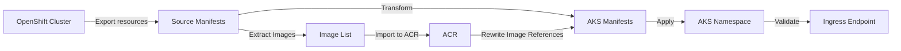

# OpenShift to AKS Migration Labs

End-to-end guided journey to: (1) deploy Azure Red Hat OpenShift (ARO), (2) deploy a sample Next.js workload on OpenShift, (3) provision an Azure Kubernetes Service (AKS) cluster + Azure Container Registry (ACR), and (4) migrate application resources and container images from OpenShift to AKS using an automated Python migration script.

## Lab Index
| Lab | Folder | Purpose | Key Entry Command |
|-----|--------|---------|-------------------|
| 1 | `lab1-deploy-aro/` | Deploy an ARO cluster (managed identity pattern) | External repo (see lab README) |
| 2 | `lab2-deploy-app-openshift/` | Deploy public Next.js image + Route on ARO | `./scripts/deploy.sh` |
| 3 | `lab3-deploy-aks/` | Provision blank AKS + ACR and emit creds to `.env` | `./scripts/deploy.sh` |
| 4 | `lab4-migration-script/` | Export → Transform → (Import Images) → Apply to AKS | `python migrate.py migrate ...` |

## Quick Start (Happy Path)
```bash
# 1. Deploy ARO (follow Lab 1 instructions externally)
# 2. Deploy sample app on OpenShift
cd lab2-deploy-app-openshift
./scripts/deploy.sh
./scripts/validate.sh

# 3. Provision AKS + ACR
cd ../lab3-deploy-aks
./scripts/deploy.sh
./scripts/validate.sh
# Review generated .env (ACR_* vars)

# 4. Migrate application to AKS with ACR image import
cd ../lab4-migration-script
pip install -r requirements.txt
python migrate.py migrate \
  --namespace nextjs-sample \
  --source-context <openshift-context> \
  --target-context <aks-context> \
  --output ./migrated \
  --acr-env-path ../lab3-deploy-aks/.env \
  --apply

# 5. Validate on AKS
kubectl get ingress -n nextjs-sample
curl -I http://<ingress-host>/
```

## Architecture Flow


## Prerequisites (Global)
- Azure subscription + Contributor (for AKS/ACR/ARO)  
- CLI Tools: `az`, `kubectl`, `oc` (Labs 1–2 & source context), `docker` (fallback image import), `jq` (Lab 3), `curl` (validation)  
- Python 3.8+ (Lab 4)  
- Network reachability from environment to source registries and Azure endpoints  
- A Red Hat pull secret (optional for ARO advanced scenarios)  

## Environment & Secrets
- Lab 3 writes ACR admin credentials to `.env`; DO NOT COMMIT this file. Ensure `.env` is listed in `.gitignore` (already handled).  
- The migration script (`lab4-migration-script/migrate.py`) loads ACR creds via `--acr-env-path`.  
- Any additional secrets (e.g., GHCR token) should be added to local `.env` only and never pushed.  
- Review exported OpenShift `secrets.yaml` before applying to AKS; prune or rotate credentials.  

## Migration Script Features (Lab 4)
- Export: Deployments, StatefulSets, Jobs, CronJobs, Services, ConfigMaps, Secrets, PVCs, ServiceAccounts, DeploymentConfigs, Routes (warns on SCCs/CRDs, BuildConfigs, ImageStreams, Templates).  
- Image Handling: Extract all referenced container images; import to ACR (`az acr import` with auth fallback to docker pull/tag/push); rewrite image registry to ACR login server.  
- Transformations: Routes → Ingress (nginx class), DeploymentConfig → Deployment, service `clusterIP/clusterIPs` stripped, metadata/status removed, optional namespace override, PVC storageClass placeholder for manual adjustment.  
- Apply: Optionally create resources on AKS; idempotent-friendly (existing objects reported).  
- Reporting: Source and AKS manifest directories + `migration-report.json`.  

## Validation (Cross-Lab)
- ARO: `oc get nodes`, `oc get clusterversion`  
- App on OpenShift: `./scripts/validate.sh` (Lab 2)  
- AKS + ACR: `./scripts/validate.sh` (Lab 3); check `.env` outputs  
- Post-Migration:  
```bash
kubectl get deployments,pods,svc,ingress -n nextjs-sample
az acr repository show-tags --name $ACR_NAME --repository nextjs-sample
curl -I http://<ingress-host>/
```

## Troubleshooting (Common)
| Symptom | Cause | Action |
|---------|-------|--------|
| Image not imported | Auth or registry unreachable | Re-run with `--verbose`; verify ACR creds; test `az acr import` manually. |
| 422 Service apply | Residual `clusterIP` | Ensure transformation strips `clusterIP/clusterIPs`; re-run migration. |
| Ingress 404 | DNS propagation or controller delay | Wait and retry; `kubectl describe ingress`. |
| Secret mismatch | Non-portable OpenShift secret | Manually adjust or recreate using AKS conventions. |
| CRD/SCC warnings | Out-of-scope migration items | Migrate manually or ignore if not required. |

## Cleanup (Unified)
```bash
# Remove migrated namespace from AKS
kubectl delete namespace nextjs-sample

# Delete AKS + ACR (Lab 3)
cd lab3-deploy-aks
./scripts/cleanup.sh

# Delete ARO cluster (Lab 1)
az aro delete --resource-group $RESOURCEGROUP --name $CLUSTER --yes
az group delete --name $RESOURCEGROUP --yes
```
## License / Usage
Internal lab and migration acceleration materials. Adapt for enterprise scenarios ensuring compliance with security and governance standards.
